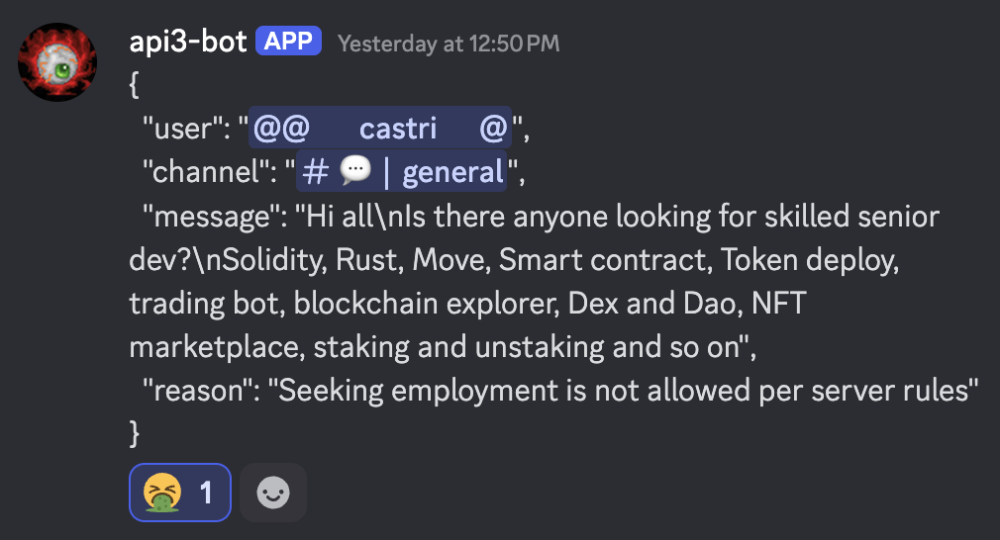

# Admins

When a message has violated the rules it is added to the `api3-bot-logs` channel where an admin will decide the next action for the message. The user of the message at this point has been placed into a 24 timeout as shown in the `api3-bot-announcements` channel.

## Workflow

All actionable messages are displayed in the `api3-bot-logs` channel.

An admin adds one of four emojis to a message in the `api3-bot-logs` channel.

### :face_vomiting

Applying this emoji executes a call to the Discord SDK to ban the user. The ban is announced in the `api3-bot-announcements` channel.

### :deaf_man

Applying this emoji executes a call to the Discord SDK to restore the message in its original channel because the admin has determined the bot was not correct in removing the message. This restore action is also announced in the `api3-bot-announcements` channel.

### :eyes

Applying this emoji does not execute a call to the Discord SDK. Here the admin has decided to investigate the message further.

### :two :number_2

Applying this emoji does not execute a call to the Discord SDK. Here the admin has decided to let the user's 24 hour timeout run its course and allow the user's continued participation, hoping that the user understands they violated the rules due to the timeout. Their original message is not restored.
